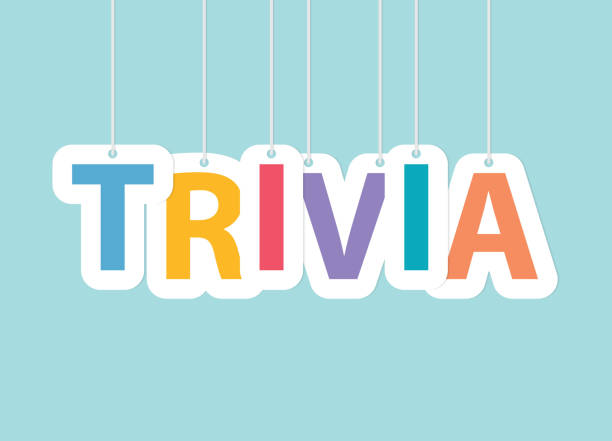

# <strong><u>Project IAAAX</u></strong> 

## Table of Contents
* [General Information](#markdown-header-general-information)
* [Technologies Used](#markdown-header-technologies-used)
* [Features](#markdown-header-features)
* [Screenshots](#markdown-header-screenshots)
* [Setup](#markdown-header-setup)
* [Usage](#markdown-header-usage)
* [Project Status](#markdown-header-project-status)
* [Room for Improvement](#markdown-header-room-for-improvement)
* [SPRINT 1](#markdown-header-sprint-1)
* [SPRINT 2](#markdown-header-sprint-2)
* [Contact](#markdown-header-contact)

---

## General Information

**What is your project?**

Personalized Trivia Web Application  

**What problem does it (intend to) solve?**

A trivia quiz app can serve many purposes - building knowledge on trivial information or challening one's knowledge on a topic. Although there are many apps available on Google Play / App Store (e.g. Trivia Crack), there's limited opportunity to continue playing as users are limited to a certain number of plays. By providing a trivia quiz app, users can engage in questions that challenges their knowledge on a subject.   

**What is the purpose of your project?**

The primary purpose of the trivia quiz web application is to create a user-centered tool that engages a users knowledge without the burden of waiting for an opportunity to continue playing after a certain number of attempts. Through this platform, we aspire to enhance user engagement, personalize quiz options, see how a user's performance compares to others, and offer an overall seamless and interative trivia quiz experience. 
Furthermore, by embedding a secure login feature, we're emphasizing the importance of user privacy and data security, ensuring that personal trivia quiz application data remains confidential and safeguarded.  

**Why did you undertake it?**

As CS Majors and asipring Software Engineers, we recognized the opportunity to apply our academic learnings to real-world challenges. In our personal experiences and observations, we identified a recurring issue faced by many: the fragmentation of trivia quiz data across various platforms. Our passion for creating intuitive and user-friendly software drove us to tackle this problem. We believe that by developing this interactive trivia quiz, we can offer a solution that not only bolsters our practical skills but also brings genuine value to potential users. It's a combination of our desire to innovate, contribute positively to the digital tools space, and apply our burgeoning skills in a meaningful manner.  

---

## Technologies Used
* **Frontend**: ReactJS/CSS/HTML
* **Backend**: [Open Trivia Database API](https://opentdb.com/api_config.php)
* **Database**: N/A
* **Tools**: VSCode/Bitbucket/Jira
* **Documentation used**: TBD  

---

## Features

* ### Navigation Bar Layout:
    * **Functionality:** Navigation bar that maps to various routes selected by the user. 
    * **Targeted Userbase:** Users who want to move around various pages in the application. 
    * **User Story:** As a web user I want a seemless experience trivia quiz between routes.   

* ### API Implementation: 
    * **Functionality:** Apply an API to the website application that offers a number of subjects and question counts. 
    * **Targeted Userabse:** Users interested in trying quizzes from various subjects with a varying amount of questions to select.
    * **User Story:**: As a trivia app developer, I want to be able to make an API call to generate a trivia quiz, so that my trivia app can provide users with engaging and challenging trivia questions for entertainment and learning purposes.   

* ### Trivia Quiz Functionality:
    * **Functionality:** Create a trivia quiz page that shows the questions from the database to the user and reveal the correct and incorrect answers once a question was selected. 
    * **Targeted Userbase:** Users interested in knowing whether their selected choices were correct. 
    * **User Story:** As a front-end engineer, I want to develop a page that allows users to select an option that will display green for a correct choice and red for an incrrect choice selected.   
 
* ### JSON Formatting:
    * **Functionality:** Adding JSON that formats the way an API makes calls from the database. 
    * **Targeted Userbase:** Users interested in building on this project. 
    * **User Story:** As a former massive Jeapordy nerd, I want to display a question to the user from a standard JSON format.   

* ### Login Functionality:
    * **Functionality:** Add user administration content to ensure that a user's information is kept confidential.
    * **Targeted Userbase:** Users wanting to ensure their information is kept confidential.
    * **User Story:** As a Front-end who is looking to create a trivia game, when I access the game's website, I want to be met with a home page that prominently showcases a GO button, enabling me to quickly dive into my trivia game experience.   

---

## Screenshots

Nothing for now!  

---

## Setup

**How to deploy on local system:** 

Install Packages: 
`npm install`

Run the program on Local Host:
`npm start`

The project site is composed of different routes that map to different components that act as their own pages consisting of their own components. JSON has been formattted to where the API makes calls from the database and the data would be displayed to the user. 

The homepage has been set as the landing page as the user starts the program in their local system. All rerouting can be done via the navigation bar. Note that when moving to the next question or restarting the game all takes place on the same route - redirecting takes place in Game.js. 

---

## Usage

**TBD**  

---

## Project Status

* Functional (NOT DEPLOYED)
* Some features not working as intended  

---

## Room for Improvement

**TBD**  

---

## Acknowledgements

**TBD**  

---

# <strong>SPRINT 1</strong>

## Retrospective

* ### What Went Well?
	* We were each able to gain the necessary knowledge about the technologies pertinent to our individual tasks.
	* We were able to create significant portions of the whole product.
	* We had frequent meetings and consistent communication.
	* Our team dynamic was very supportive and constructive throughout the entire sprint.  
	
* ### What Didn't go Well?
	* Calvin - Learning mySql in combination with Flask and SQLAlchemy proved to consume far more time than I initally thought. This led to a delay in the completion of useful database functionality.
	* Axel - Short time period to realize that the initial react package didn't support event adding and that another was needed to be viewable to the user.
	* Mark - I spent too much time going back and redoing code to try to make it less messy. I should have just accepted it as it was to move on to other things.
	* Tim - Had to refactor codebase to allow unit test to run.
	* David - I was unable to figure out how to deploy my code with firebase so that my dev.env file would be protected and not show any secrets.  
	
* ### What Can I do Better?
	* Calvin – Could have found a temporary database solution to allow early implementation by other team members.
	* Mark - Should have worked more to include outside code and packages to speed up work rather than trying to learn everything from scratch. Also could have communicated better with the frontend team to work together on our solution so as to not be split.
	* Tim - Could have used a unit test tutorial earlier to prevent false positives. Implemented a User Class from the beginning instead of refactoring functional code to implement the class. This would have eased development and added extendibility with other libraries like unittest. Provide a clearer breakdown of what components I would implement and what technologies used.
	* David - Could have coordinated with the team to ensure that my project would have been easily implemented with the rest of the team.
	* Axel - Should have found a react library package that supported event adding/removing/deleting along with more CSS details that would make the window more appealing to the user.  

* ### What Might Be Impeding Us from Performing Better?
	* We were each too focused on individual tasks, and not focused enough on merging our individual components.
	* We didn't include tasks to combine our components into a final product.  

* ### Plans for Sprint Two
	* Combine login system with database functions in order to allow for seamless user login and database management.
	* Create API that returns event and user information in JSON format to be usable by the front end.
	* Implement dedicated database to allow for remote access.
	* Add options for more detailed event information such as specific times.
	* Add more functionality to the front end such as a remove event button.
	* Swiftly combine front and back end, then maintain a functioning product to add onto.  

---

# <strong>SPRINT 2</strong>

## Retrospective:
* ### What went well for us as a team?
    * We worked great as a team and we managed to communicate effectively to mitigate the amount of merge conflicts and allow all our branches to be merged.
    * This sprint, our communication and coordination far exceeded our previous sprint. Our group dynamic was excellent, and we truly worked together on this project.
    * As a team our planning was more in depth and we made changes as needed.
    * We added work when we completed our features.
    * The team would actively review pull requests.  

* ### What did or did not go well for us individually?
    * <strong>Timothy Maraj:</strong> We collaborated often and frequently every night at the same time to complete features, discuss integration of components, and concerns.
    * <strong>Calvin Albin:</strong> The only thing that went wrong this sprint was a slight bug with the API. Certain combinations of trivia categories, difficulties, and question types had fewer questions than others, which can cause problems with the game itself. Fortunately, each combination has at least 10 questions, so everything is playable.
    * <strong>David Mojica:</strong> I got  all the components I wanted to complete out and merged into the demo branch.
    * <strong>Mark Tschirhart:</strong> I felt a lot more at ease with everyone working on the same technology, as it meant that when one of us hit a block, we could get help from any one of the other teammates.
    * <strong>Axel Sanchez Moreno:</strong> We all collaborated as a team to produce a project that we enjoyed while learning new material.  

* ### What might be impeding us from performing better?
    * Each member has a different schedule and obligations to fulfill making it hard to collab.
    * We restarted from a completely new project.
    * Everyone has a different level of understanding with the react framework and experience with javascript.  

* ### What can we individually do to improve?
    * <strong>Timothy Maraj:</strong> Learn more in depth how the web hooks and API is integrated into the project.
    * <strong>Calvin Albin:</strong> I can plan my tasks more accurately. This sprint, two of my tasks proved to be redundant, which caused me to change them mid sprint. With the knowlege that I gained this sprint, I will be able to create tasks with no redundancy.
    * <strong>David Mojica:</strong> Should have  met more with team to talk about across platform styling.
    * <strong>Mark Tschirhart:</strong> I can definitely increase in output by focusing less on niche issues and more broad things that can be quickly accomplished.
    * <strong>Axel Sanchez Moreno:</strong> Refer to ChatGPT more on ideas that would be based on my user story for developing tasks on the project.  

## Contributions:
* ### Timothy Maraj:
    * [SCRUM-60](https://cs3398f23borgs.atlassian.net/browse/SCRUM-60) - <strong>"Create A Home Page that is reusable and utilizes components":</strong>
        * The idea behind this was to have a landing page for the user.
        * This would draw them in by having a the select options in which to start the game. 

    * [SCRUM-65](https://cs3398f23borgs.atlassian.net/browse/SCRUM-65) - <strong>"Redirect by clicking the GO button, redirect the user to the trivia game page to begin the gameplay":</strong>
        * This button will redirect to the game page if or not the user has selected options as inputs. 

    * [SCRUM-68](https://cs3398f23borgs.atlassian.net/browse/SCRUM-68) - <strong>"Style Home Page and Button to be visually appealing":</strong>
        * Adding styling to the page so it does not look like a basic html page.
        * This styling focuses heavy on blues and purples. 

    * [SCRUM-70](https://cs3398f23borgs.atlassian.net/browse/SCRUM-70) - <strong>"Research how to create a component and style it in a way that is extendable/reuseable":</strong>
        * This was on going research that never stopped. 
        * There is always a way to improve your understanding.
        * I learned about the basic features of a component and how to build one. 

    * [SCRUM-80](https://cs3398f23borgs.atlassian.net/browse/SCRUM-80) - <strong>"Create Go Button to be displayed on the Home page, again making this component reusable for other portions of the application":</strong>
        * This button is reusable, however is only used on the home page.
        * The text in the button could be changed if the a parameter for a label was used. 

    * [SCRUM-93](https://cs3398f23borgs.atlassian.net/browse/SCRUM-93) - <strong>"Add Leaderboard to display users scores, and style":</strong>
        * Added a leaderboard to display mock scores.
        * To update the scores in real time we will add work for sprint three to handle this. 

    * [SCRUM-94](https://cs3398f23borgs.atlassian.net/browse/SCRUM-94) - <strong>"Add information to about page and more style icons":</strong>
        * Updated the about page to reflect more information about us.
        * Added personalized icons like youtube, snapchat and github at the request of the team. 

    * [SCRUM-97](https://cs3398f23borgs.atlassian.net/browse/SCRUM-97) - <strong>"Update Footer and About Page with Developer Information":</strong>
        * Updated information on the footer to reflect the team's info.  

* ### Calvin Albin: 
    * [SCRUM-51](https://cs3398f23borgs.atlassian.net/browse/SCRUM-51?atlOrigin=eyJpIjoiNjZjODM1Y2JlYzgyNDc5ZDk1ZGFlYjM1MTQ4ODg2NjMiLCJwIjoiaiJ9) - <strong>"Research React and JavaScript with focus on API calls and formatting":</strong>
        * This task was used to help me gain a baseline understanding of JavaScript and React, because I hadn't used these technologies before.
        * I added my notes to a research document.

    * [SCRUM-53](https://cs3398f23borgs.atlassian.net/browse/SCRUM-53?atlOrigin=eyJpIjoiNTIxZjQ2MTlhNzRlNDcxOGI0MWZjYjhmMTlhM2Q0OGQiLCJwIjoiaiJ9) - <strong>"Call openTDB API and generate trivia quiz":</strong>
        * In this task, I called the TriviaBD API with static parameters that would generate a general knowlege, multiple choice, easy, 10 question quiz.

    * [SCRUM-61](https://cs3398f23borgs.atlassian.net/browse/SCRUM-61?atlOrigin=eyJpIjoiZTcwYjhhOTgxZGNiNDJhOGIzNzk1YTA3M2U0ZmQzM2UiLCJwIjoiaiJ9) - <strong>"Make settings show up in boxes once they are selected on home page":</strong>
        * In this task, I edited the settings/home page so that the selected settings would appear in the boxes once they had been selected.
        * Additionally, I changed the size of the boxes.

    * [SCRUM-59](https://cs3398f23borgs.atlassian.net/browse/SCRUM-59?atlOrigin=eyJpIjoiMjhlZDcwYmJlMWQ3NGY1Yzg4ZjBjNjJkZWZhNmEyYjQiLCJwIjoiaiJ9) - <strong>"Link settings page to API Call":</strong>
        * In this task, I linked the Settings.js and SelectField.js files to the Game.js file.
        * This allowed the user to play the trivia game that they customized on the settings page.

    * [SCRUM-55](https://cs3398f23borgs.atlassian.net/browse/SCRUM-55?atlOrigin=eyJpIjoiYmJiYTg4OGFkNDAwNDU1YWJkYWI3MWNjNzQzYWE0MWEiLCJwIjoiaiJ9) - <strong>"Test different combinations of settings in quiz application":</strong>
        * In this task, I tested many different combinations of settings for the game.
        * This proved to be very important, as some combinations of settings had fewer questions than others.
        * If a user selects more questions than a category has, the game will crash.  

* ### David Mojica: 
    * [SCRUM-82](https://cs3398f23borgs.atlassian.net/browse/SCRUM-82) - <strong>"Create footer":</strong>
        * This created a basic footer.

    * [SCRUM-78](https://cs3398f23borgs.atlassian.net/browse/SCRUM-78) - <strong>"Major refactoring and creating dev branch and Redoing README":</strong>
        * This was the creation of the react app as well as adding stuff to the read me.

    * [SCRUM-64](https://cs3398f23borgs.atlassian.net/browse/SCRUM-64) - <strong>"Create nav bar":</strong>
        * This was the creation of the dynamic navbar.

    * [SCRUM-66](https://cs3398f23borgs.atlassian.net/browse/SCRUM-66) - <strong>"Create the app.js that displays the game route":</strong>
        * This branch was just refactoring the old format to make it more standard and merging into main as a team.

    * [SCRUM-86](https://cs3398f23borgs.atlassian.net/browse/SCRUM-86) - <strong>"Add content to the About page":</strong>
        * This was the creation of the basic about page.

    * [SCRUM-88](https://cs3398f23borgs.atlassian.net/browse/SCRUM-88) - <strong>"Hotfix for axios":</strong>
        * Small hotfix for fixing our packagelock.

    * [SCRUM-89](https://cs3398f23borgs.atlassian.net/browse/SCRUM-89) - <strong>"Fix Navbar scaling":</strong>
        * This was bug fixing the nav bar for correct scaling.

    * [SCRUM-96](https://cs3398f23borgs.atlassian.net/browse/SCRUM-96) - <strong>"HOTFIX: Hide elements when scaling to mobile":</strong>
        * This was a bug fix that would allow user to scroll out of bounds.

    * [SCRUM-99](https://cs3398f23borgs.atlassian.net/browse/SCRUM-99) - <strong>"change css from Tim":</strong>
        * This was fixing Tims padding.  

* ### Mark Tschirhart:
    * [SCRUM-72](https://cs3398f23borgs.atlassian.net/browse/SCRUM-72) - <strong>"Display a (placeholder) question for the user to answer":</strong>
        * I initially was setting up displaying a sample question from a placeholder set. This changed as work progressed and I switched gears.
        * Instead I grabbed a sample API response from our trivia API and modeled how a function to properly display the question from the sample JSON.

    * [SCRUM-73](https://cs3398f23borgs.atlassian.net/browse/SCRUM-73) - <strong>"Manipulate sample JSON data for answers into parsed format":</strong>
        * Following SCRUM-72, I worked on a function to navigate the answers of the sample JSON and convert them into a data structure that worked with the quiz logic Axel built.
        * This took a bit of trial and error, but was worth the time investment as it meant that nothing on the quiz logic side had to be changed.
        * Additionally, a scrambling functionality was added to mix up the answers so that the order didn't give away the correct answer.

    * [SCRUM-74](https://cs3398f23borgs.atlassian.net/browse/SCRUM-74) - <strong>"Pull the question from the JSON API":</strong>
        * This task was about changing the function to pull from the API instead of using the sample JSON.
        * Here, I used the response generated by Calvin's API call to pass into the necessary functions.

    * [SCRUM-75](https://cs3398f23borgs.atlassian.net/browse/SCRUM-75) - <strong>"BUGFIX: Need to move functions outside of Game function to avoid rerunning every render":</strong>
        * Axel discovered this bug by running tests of the same game over and over and finding that the question order was different every time he played through.
        * After thorough debugging, I found this was a symptom of the Game function rewriting the questions array every time it rerendered.
        * Despite the title of this task, I did not move the functions outside of Game.
        * To fix this, I added a Boolean variable that represented whether a set of questions had been generated yet, and added the not of the variable to the condition to run the parsing functions.
        * This way, the function call to parse the API response only happens once per page load, resolving the observed and underlying issue.

    * [SCRUM-76](https://cs3398f23borgs.atlassian.net/browse/SCRUM-76) - <strong>"Add a button to get a new quiz":</strong>
        * In this task, I was attempting to add a button that would let the user generate a new API request using the same settings they chose for the last game they played.
        * This ended up being much more difficult than I anticipated, as it involved storing data on the client's browser while fully refreshing the page.
        * On full refresh, local storage was being lost, meaning I couldn't save the URL used to generate the last API request.
        * Due to time constraints, I decided to table the idea, and use a simpler implementation.
        * In the current version, "Restart Game" generates a new API request using default settings.
        * This gives the user a fresh quiz, but with preset parameters.
        * Additionally, I added a "Back to Game Settings" button that returns the user to the Home screen, where they can choose the settings to use for a new game.  

* ### Axel Sanchez Moreno: 
    * [SCRUM-90](https://bitbucket.org/cs3398f23borgs/%7Bc31c3480-9d4f-41ff-a502-83b78c1e01da%7D/pull-requests/60) - <strong>"Refactor Game.js and PageNotFound.js to be in separate folders":</strong>
        * Moving Game.js,  PageNotFound.js, and their respective CSS files into their own separate folders and rewriting the directory of both files into Home.js file.

    * [SCRUM-81](https://bitbucket.org/cs3398f23borgs/%7Bc31c3480-9d4f-41ff-a502-83b78c1e01da%7D/pull-requests/32) - <strong>"Modify 404 Message Screen":</strong>
        * Edit the way a user sees a 404 message by adding confetti and a gif meme as a "punishment" for producing said error. 

    * [SCRUM-79](https://bitbucket.org/cs3398f23borgs/%7Bc31c3480-9d4f-41ff-a502-83b78c1e01da%7D/pull-requests/63) - <strong>"Update README.MD":</strong>
        * Update the material in the README.md file where an overview of the material is presented to a non-expert audience or user interested in using the project.

    * [SCRUM-71](https://bitbucket.org/cs3398f23borgs/%7Bc31c3480-9d4f-41ff-a502-83b78c1e01da%7D/pull-requests/41) - <strong>"Change the color button based on whether it's correct or not":</strong>
        * Including CSS where the user is shown which options are correct/incorrect after an option is selected.
        * This did involve adding/modifying the ternary operators in Game.js. 

    * [SCRUM-67](https://bitbucket.org/cs3398f23borgs/%7Bc31c3480-9d4f-41ff-a502-83b78c1e01da%7D/pull-requests/53) - <strong>"Add supplemental features to Game.js and Error.js":</strong>
        * Adding additional CSS or code modifications to both Game.js and Error.js. 

    * [SCRUM-58](https://bitbucket.org/cs3398f23borgs/%7Bc31c3480-9d4f-41ff-a502-83b78c1e01da%7D/pull-requests/30) - <strong>"Add Basic Functionality to the Quiz":</strong>
        * Adding ternary operators that move through the trivia quiz. 

    * [SCRUM-57](https://bitbucket.org/cs3398f23borgs/%7Bc31c3480-9d4f-41ff-a502-83b78c1e01da%7D/pull-requests/31) - <strong>"Add a button that take the user to start a quiz":</strong>
        * Add a ternary operator that displays the start screen for a user when entering the quiz.
        * Modifying the code in SCRUM-58 as the user moves through the quiz.  

---

## Contact 
- Timothy Maraj: Frontend Engineer
- Calvin Albin: API Engineer
- David Mojica: Frontend Engineer
- Mark Tschirhart: Frontend Engineer
- Axel Sanchez Moreno: Frontend Engineer
# TimDaMan
